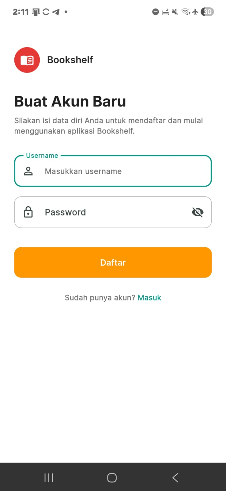
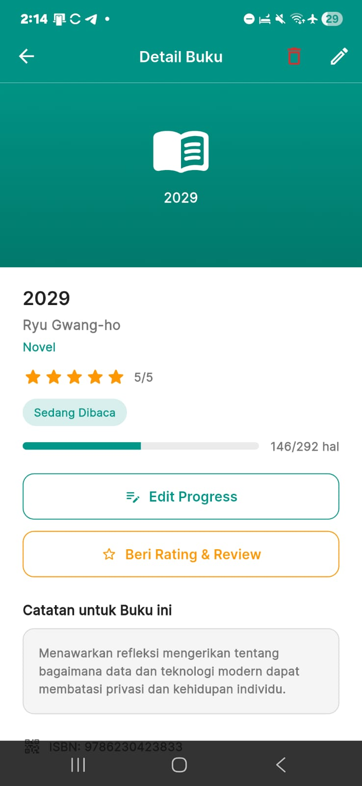
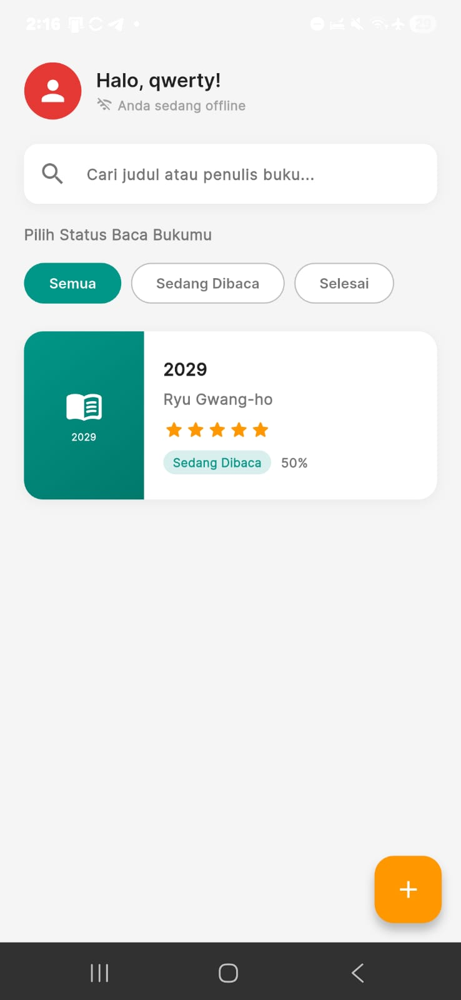

# Bookshelf — Reading Tracker and Book Catalogue Application

Bookshelf merupakan aplikasi pengelola koleksi buku pengguna secara privat. Bookshelf dirancang untuk mencatat dan merekap daftar buku yang telah dibaca oleh pengguna dalam jangka waktu tertentu. Di samping itu, Bookshelf juga mampu merekap progres pembacaan buku serta memberi rating-review pada buku yang telah dibaca. Data tersimpan lokal di IsarDB kemudian dapat disinkronkan ke backend agar koleksi buku bisa diakses dari mana saja. Bookshelf berbasis Mobile yang mendukung fungsionalitas secara luring memakai IsarDB dengan sinkronisasi data ke *cloud server* ketika user daring kembali.

Project ini dibuat untuk tugas MobTeam #2 — Backend & Local Database dengan studi kasus Aplikasi Katalog Buku & Reading Tracker.

---

## Anggota dan pembagian tugas Tim 2
1. Mikail Achmad (Mobile Developer & Integrator): Bertanggung jawab membangun antarmuka (UI) aplikasi dengan Flutter, mengimplementasikan database lokal (IsarDB) untuk mode offline-first, menyusun logika sinkronisasi data yang robust dengan API, dan mengatasi konfigurasi build APK Android.
2. Marcelino Budi Prakasya (Backend Developer): Bertanggung jawab merancang dan membuat REST API menggunakan Golang, mengelola basis data PostgreSQL, menangani konversi tipe data dari JSON ke DB format, serta melakukan deployment server API ke VPS Linux.

---

## Tech Stack Proyek

| Layer | Teknologi | Catatan |
| :--- | :--- | :--- |
| **Mobile Front-end** | Flutter (Dart SDK) | Manajemen UI/UX dan State Management |
| **Local Database** | IsarDB | Penyimpanan model Buku, Progres, dan Review secara lokal (*offline*) |
| **Back-end API** | Go (Chi) | Penyedia REST API untuk manajemen data terpusat |
| **Server Database** | PostgreSQL | Penyimpanan data persisten di tingkat *cloud server* |
| **HTTP Client** | Dio / Http (Package) | Media komunikasi data dari Flutter menuju Flask API |

---

## Fitur Utama Bookshelf
**Frontend Mobile (Aplikasi):**
- Autentikasi pengguna (Login & Register).
- Manajemen data buku (Create, Read, Update, Delete).
- Mode *Offline-First* (Bisa digunakan tanpa internet).
- Fitur sinkronisasi data 2 arah (Lokal ke Server & Server ke Lokal).
- Fitur *Scan Barcode/QR Code*.

**Backend API (Server):**
- RESTful API terpusat untuk melayani HTTP Request.
- Autentikasi keamanan berbasis Token JWT.
- Penerimaan operasi data jamak (*bulk actions*) via `HTTP POST`.

## Struktur Direktori Proyek (Monorepo)
Untuk menjaga modularitas, repositori ini menggunakan arsitektur monorepo yang memisahkan kode aplikasi mobile dengan server backend:

```text
katalog-buku/
├── backend/                 # Workspace Marcel (Flask API)
│   ├── internal/            # Kode berisi logika, autentikasi, database, dan lain-lain.
│   ├── sql/                 # Skema dan migrasi DDL PostgreSQL
│   └── main.go              # Script utama server Go
│   └── sqlc.yaml            # Konfigurasi ORM/Database
│
├── apps/mobile/            # Area pengembangan frontend aplikasi mobile
│   ├── lib/                # Source code Dart (Views, Models, Services)
│   ├── ├── models/         # Definisi skema objek IsarDB
│   ├── ├── views/          # Komponen antarmuka (UI Pages & Widgets)
│   ├── ├── services/       # Handler integrasi HTTP / API (Dio)
│   └── ├── main.dart       # Entry point aplikasi Flutter
│   ├── android/            # Konfigurasi platform Android & Gradle
│   └── pubspec.yaml        # Daftar dependency Flutter (Isar, http, dll)
└── README.md                 # Dokumentasi proyek
```

--- 

## Preview Aplikasi

<table>
  <tr>
    <td align="center">
      <br>
      <b>Sign Up</b>
    </td>
    <td align="center">
      <br>
      <b>Book Detail</b>
    </td>
    <td align="center">
      <br>
      <b>Book List</b>
    </td>
  </tr>
</table>

## Links
- Endpoint Bookshelf:http://103.23.198.215/api/v1
- Dokumentasi API: https://mobteam-2-bookshelf.github.io/katalog-buku/
- Mendapatkan buku acak: https://api.bukuacak.shabsolute.tech/api/v1/random_book
--- 

### Pemasangan Aplikasi

Ikuti langkah-langkah berikut untuk menginstal aplikasi **Bookshelf** pada perangkat Android:

1. Unduh atau salin file **`app-arm64-v8a-release.apk`** ke perangkat Anda.
2. Buka file **`app-arm64-v8a-release.apk`** melalui File Manager.
3. Tekan tombol **Install** dan tunggu hingga proses instalasi selesai.
4. Setelah instalasi berhasil, tekan tombol **Open** atau buka aplikasi melalui ikon **Bookshelf** pada layar utama perangkat.
5. Aplikasi **Bookshelf** siap digunakan.

> **Catatan:** Jika muncul peringatan keamanan saat instalasi, aktifkan izin **Install from Unknown Sources** sesuai pengaturan perangkat Android yang digunakan.

---

## Menjalankan Aplikasi dengan Flutter
```text
flutter pub get
flutter run
```
Note: Jika ingin menggunakan REST API yang dijalankan secara lokal, ganti `_baseUrl` pada file `apps\mobile\lib\services\api_service.dart`. Misal `_baseUrl = 'localhost/api/v1`

--- 

## Menjalankan Backend Server
### 1. Install
<b>Database</b>
<ul>
<li>Install postgres Database </li> 
<li>Setup username (default: postgres), password, and PORT (default: 5432)</li>
<li>Pastikan server database aktif</li>
</ul>
<b> SQL Migration Helper </b>

```text
go install github.com/sqlc-dev/sqlc/cmd/sqlc@latest
go install github.com/pressly/goose/v3/cmd/goose@latest
```

### 2. Environment Variable
Pastikan environtment variable yg diperlukan sudah tersedia:
<ul>
<li>`PORT`</li> 
<li>`DB_URL`</li>
<li>`JWT_KEY`</li>
</ul>
lihat di `backend/.env_example`

### 3. Database migration
```
cd /backend/sql/schema
goose postgres "user=<db-user> password=<your-password> host=<url> port=5432 dbname=bookshelf sslmode=disable" up
```
### 4. Parse SQL into type-safe and idiomatic code (Optional)
```
cd /backend
sqlc generate
```
### 5. Build and Run Go server
```
cd /backend 
go build 
./bookshelf
```

## Alur Demo yang Disarankan
1. Autentikasi: Buka aplikasi dan lakukan Login (atau Register akun baru)
2. Kondisi Online: Tambahkan 1-2 buku baru dan pastikan data muncul di Beranda.
3. Kondisi Offline: Matikan koneksi internet HP (Airplane Mode).
4. Manipulasi Offline: Tambahkan 1 buku baru lagi, edit 1 buku lama, dan hapus 1 buku lainnya tanpa koneksi internet. Tunjukkan bahwa UI tetap merespons dengan cepat.
5. Kondisi Online: Nyalakan kembali internet.
6. Eksekusi Sinkronisasi: Buka halaman Profile dan tekan tombol "Sinkronisasi". Tunjukkan bahwa tidak ada data loss dan semua perubahan offline sukses terkirim ke server API.

## Status Akhir Project Saat Ini
Aplikasi Bookshelf telah berhasil dibangun menjadi format .apk akhir dengan kapabilitas Offline-First yang stabil dan bebas crash. Backend API telah aktif di-deploy ke VPS dan melayani permintaan sinkronisasi data antar client-server secara presisi.
